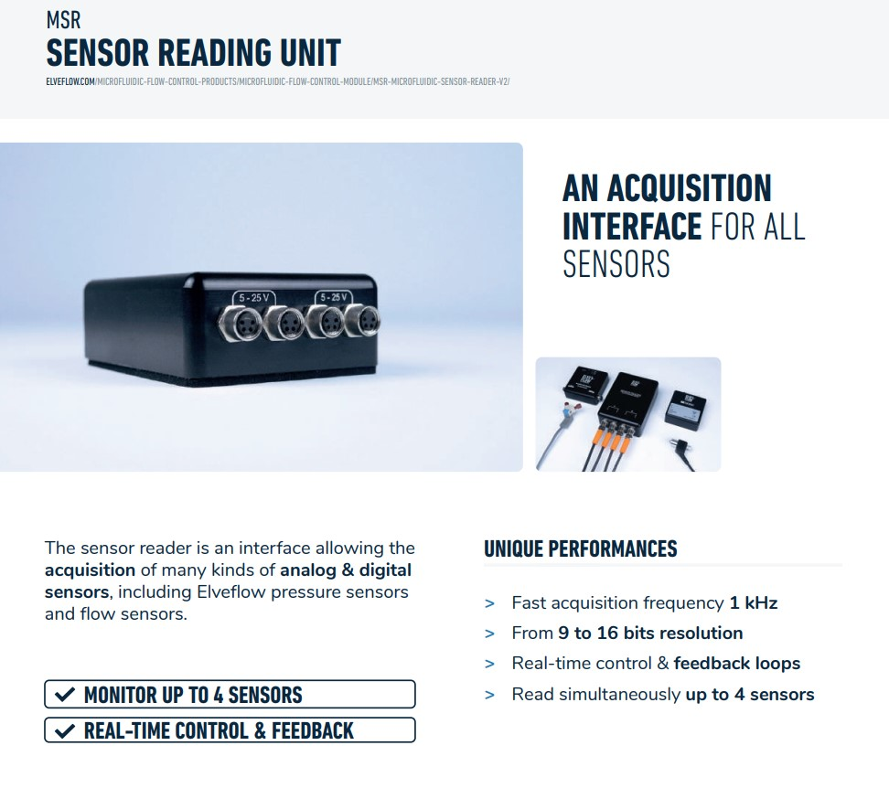
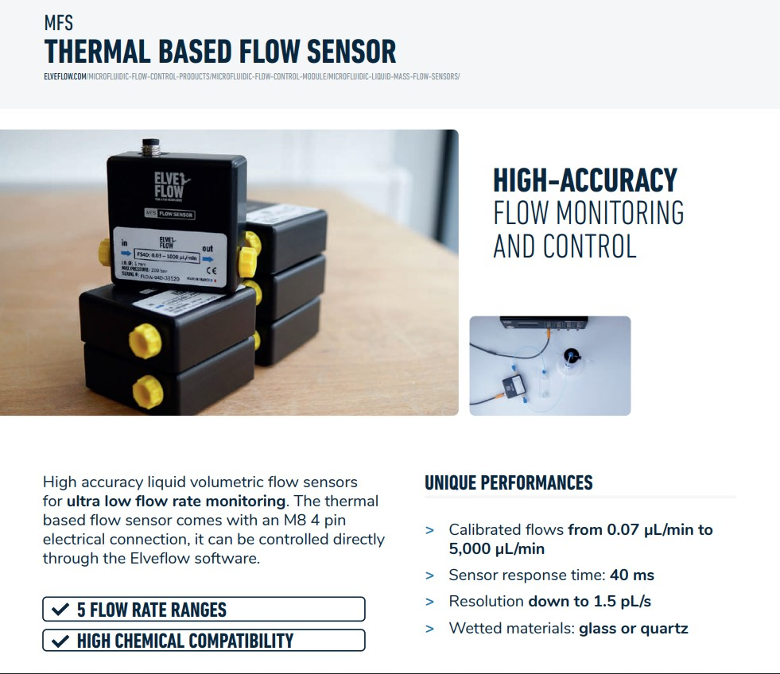
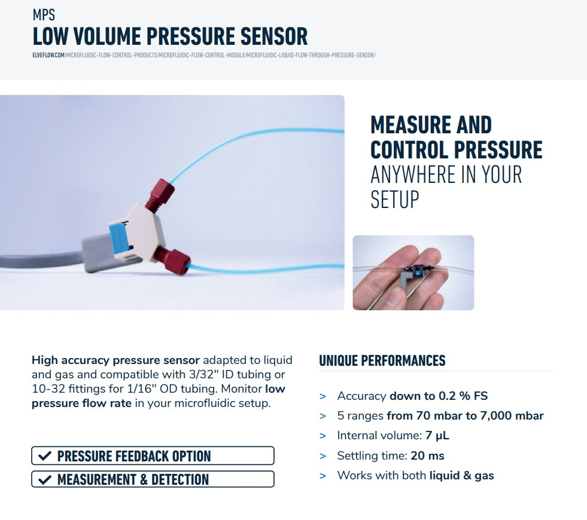

# Python bindings for ElveFlow Sensor Reader

**SDK source (Version 3.06)  from ElveFlow official [Website](https://www.elveflow.com/microfluidic-products/microfluidics-software/elveflow-software-sdk/ "sdk 3.06")**

Pictures from ElveFlow PRODUCT_CATALOG_2022

## Instruments

### 1. Microfluidic Sensor Reader

### 2. Flow Sensor

### 3. Presurre Sensor

## Usage

 The folder `</DLL64>`  include the C/C++ api dll for All ElveFlow products , use ctypes in python to deal with the C/C++ library, the ElveFlow64.py provide ElveFlow offical python wrappper for it.

### 1. Basic function
